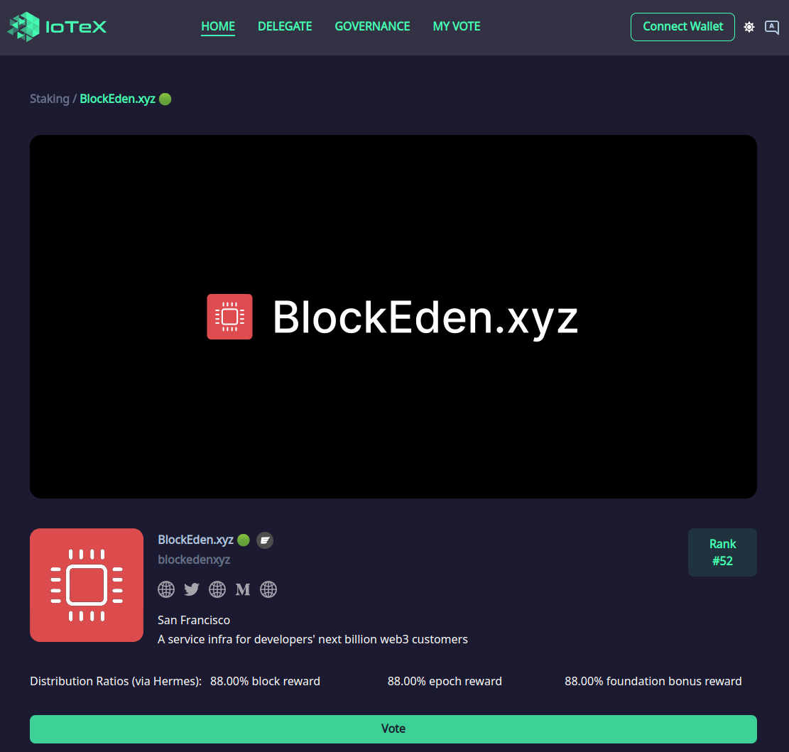
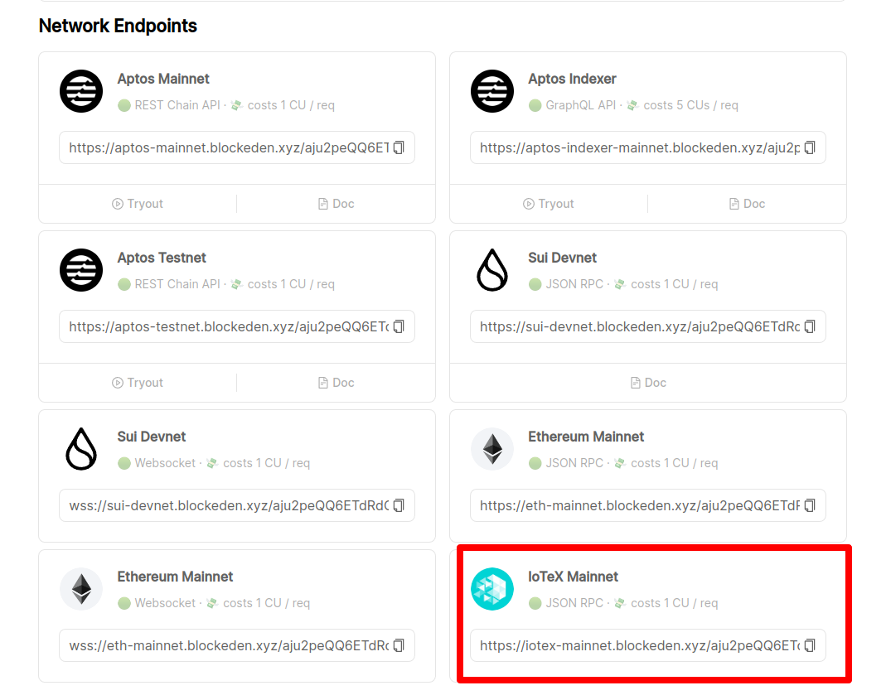

Recently Iotex and BlockEden.xyz [partnered](https://blockeden.xyz/blog/2023/01/27/blockeden-xyz-teams-up-with-iotex-to-simplify-decentralized-iot-application-development/) together to bring the revolutionary experience to IoT developers. We committed to this mission seriously, and today we want to share 2 exciting updates with ecosystem.

## IoTeX Delegate

We believe staking is one of most important things for blockchain, because it helps to ensure the integrity of the network by incentivizing participants to act in the best interest of the network.

One of the key benefits of staking is that it makes it more difficult and expensive for bad actors to attack the network. If a participant attempts to validate fraudulent transactions, they risk losing their staked cryptocurrency, as well as any rewards they have earned. This serves as a powerful deterrent to malicious behavior, as it aligns the incentives of participants with the overall health and security of the network.

Now BlockEden.xyz joined IoTeX delegate program, and **we have our running delegate**! [https://stake.iotex.io/delegate/blockedenxyz](https://stake.iotex.io/delegate/blockedenxyz) is our delegate profile. This is our reward plan:

- Hermes will distribute **88%** of the rewards to you automatically. Payout frequency is every day at midnight (UTC time).
- We take 12% to cover the server and development costs for our collaboration with IoTeX.

**Please vote for BlockEden.xyz today!** Your support is critical for us to continuously build in the IoTeX ecosystem!

## RPC Serivce

BlockEden.xyz's mission is to empower dApps, and we decided to bring this to IoT territory. In additon to the delegate program, we also suported JSON-RPC service for IoTeX. Therefore, if you're a dApp developer on IoTeX blockchain, you no longer need to setup your own IoTeX full node, and just [sign up](https://blockeden.xyz/dash/sign-up/) with us to start interacting with IoTeX blockchain **from free**.

### Why JSON-RPC first?

IoTeX blockchain provides 2 types of RPC endpoints: **gRPC** and **JSON-RPC**, and we choose to support **JSON-RPC** first because:

- This RPC type could easily integrate with MetaMask for wallet service.
- It's the RPC type of Ethereum blockchain and its L2 blockchains. It will be easier for an Ethereum developer to migrate to IoTeX.

### gRPC vs JSON-RPC

There are some other deep thinking about **gRPC** and **JSON-RPC**. Please let us know your thoughts about whether you want **gRPC**.

#### gRPC

Pros:

- High performance: gRPC is based on the high-performance, low-latency protocol called HTTP/2, which allows for efficient multiplexing of requests and responses over a single TCP connection. This can lead to faster response times and lower network overhead compared to traditional REST APIs that use HTTP/1.1.
- Efficient data serialization: gRPC uses Protocol Buffers as its default data serialization format, which is more compact and efficient than JSON or XML. This can reduce the amount of network bandwidth and CPU time required to serialize and deserialize data.
- Language-agnostic: gRPC supports a wide range of programming languages, including Java, Python, C++, and many more, making it a good choice for heterogeneous systems.
- Built-in support for streaming: gRPC supports both server-side and bidirectional streaming, which can be useful for real-time applications or long-running processes that need to exchange data in real-time.

Cons:

- More complex setup: gRPC requires a more complex setup compared to JSON-RPC, especially if you're using it with non-standard protocols like HTTP/2 or TLS.
- Less readable format: While Protocol Buffers are more compact and efficient, they are also less human-readable than JSON, which can make debugging more difficult.
- Higher learning curve: gRPC uses a different programming paradigm compared to traditional REST APIs, which can make it more challenging for developers to learn and adopt.

#### JSON-RPC

Pros:

- Simplicity: JSON-RPC is a simple, lightweight protocol that is easy to learn and use. It can be a good choice for small-to-medium-sized applications or simple microservices.
- Human-readable format: JSON is a human-readable format that is easy to read and debug, which can be helpful for developers.
- Flexible: JSON-RPC is a flexible protocol that can be used over a variety of transport protocols, including HTTP, TCP, and WebSockets.
- Language-agnostic: Like gRPC, JSON-RPC is also language-agnostic and can be used with a wide range of programming languages.

Cons:

- Lower performance: JSON-RPC uses JSON as its default data serialization format, which can be less efficient in terms of network bandwidth and CPU time compared to Protocol Buffers or other binary formats.
- Limited support for streaming: JSON-RPC supports only one-way streaming, which may not be sufficient for some real-time applications or long-running processes.
- No built-in support for service discovery or load balancing: JSON-RPC doesn't provide built-in support for service discovery or load balancing, which means you may need to implement these features yourself.

## What is IoTeX?

IoTeX is an open-source platform founded in 2017 with a vision of blockchain for the Internet of Trusted Things. The platform enables various machines and people to interact securely and trustingly with each other. In doing so, IoTeX ensures that everyday people and businesses own their devices and the data/value they generate from them. By connecting physical and digital worlds, IoTeX aims to democratize access to machine-backed DApps, assets, and services while delivering value to users and fueling the new machine economy.

## What is BlockEden.xyz?

BlockEden.xyz is a service infra for the developer’s next billion web3 customers. It strives to provide developers with all they need to create powerful applications quickly and scale faster. We have operated Aptos public full node since day 1 of its mainnet launch. We serve managed RPC services to 400+ clients (Scalp Empire NFT Analytics, HoustonSwap, Solaland NFT Toolkit, Fewcha Wallet, etc.) in the ecosystem with zero downtime. We are on our way to becoming a validator for Aptos, Sui, Shentu, and EthStorage.

**How to stay in the loop?**

For IoTeX, go to

- Twitter: https://twitter.com/iotex_io
- Discord: https://iotex.io/discord

For BlockEden.xyz, go to

- Twitter: https://twitter.com/BlockEdenHQ

- Discord: https://discord.gg/4Yfvs2HWey

Source Link: https://blockeden.xyz/blog/2023/02/20/iotex-validator-and-json-rpc/
